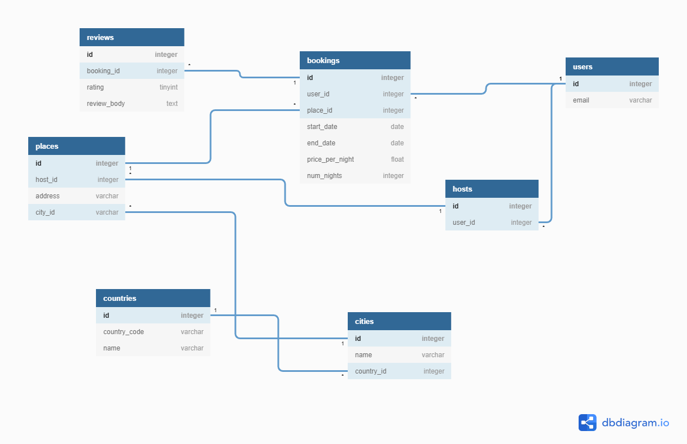

# <center>  Creating database in SQLAlchemy </center>

This script described the process of creating a table in a database with SQLAlchemy based on [ORM](https://en.wikipedia.org/wiki/Object-relational_mapping) methodology.


### Assumptions

Suppose we want to create tables

- Authors

| id 	| name      	| surname       	| born_date  	|
|:--:	|:-----------:	|:---------------:	|:------------:	|
| 1  	| William   	| Shakespeare   	| 26.04.1564 	|
| 2  	| Albert    	| Camus         	| 7.11.1913  	|

- Books

| id 	| id_author 	| original_title 	| publication_date 	| original_language 	|
|:--:	|:---------:	|:--------------:	|:----------------:	|:-----------------:	|
|  1 	|     1     	|     Hamlet     	|       1603       	|      english      	|
|  2 	|     1     	|    King Lear   	|       1606       	|      english      	|
|  3 	|     2     	|    La Peste    	|       1947       	|       french      	|

### Prepare the environment
To correct working of this process we need create connection to database and 

```python
from sqlalchemy import create_engine
from sqlalchemy.ext.declarative import declarative_base

db_string = "postgres://user:password@ip_adrress:port/db_name"

engine = create_engine(db_string)

Base = declarative_base()


```

Nowadays when we using the orm technique we need describing the database tables using class. This process has name [Declarative System](https://docs.sqlalchemy.org/en/13/orm/extensions/declarative/index.html). In SQLAlchemy we use this functionality by API [declarative](https://docs.sqlalchemy.org/en/13/orm/extensions/declarative/api.html).

Line *Base = declarative_base()* run automatically process of mapping existing tables in a database to class and give us tools to declare new tables schema.  

### Creating tables structure

To declaration new table schema we need to add tools to mapping variable types from the database to Python: 
```python
from sqlalchemy import Column, Integer, String, Date
```

Now we can describe *authors* table:

```python
class Author(Base):
    __tablename__ = 'authors'
    id = Column(Integer, primary_key=True)
    name = Column(String(50))
    surname = Column(String(50))
    born_date = Column(Date)

    def __repr__(self):
        return "<authors(id='{0}', name={1}, surname={2}, born_date={3})>".format(
            self.id, self.name, self.surnamey, self.born_date)
```

To correct work *declarative_base* mechanizm we must set **\_\_tablename\_\_** attribute. Database server use **__tablename__** as table name. 
In column **name** and **surname** we use *String(50)* to make constraint to string length storage in the database. *primary_key=True* define Primary Key of this table. Columns name used on the database server are identical like class attributes name in Python. 
This procedure is equivalent of SQL code:
```sql
CREATE TABLE public.authors
(
    id integer NOT NULL DEFAULT nextval('authors_id_seq'::regclass),
    name character varying(50),
    surname character varying(50),
    born_date date,
    CONSTRAINT authors_pkey PRIMARY KEY (id)
)

TABLESPACE pg_default;

ALTER TABLE public.authors
    OWNER to postgres;
```
Function *\_\_repr\_\_* is decorator to string formatting after query results.


Let's assume that we want now create new table *books*, where we connect books with the author. For that, we need to create the relation between table *authors* and *books* by Foreign Key in table *books*.

On the begining 

```python
from sqlalchemy import ForeignKey

class Book(Base):
    __tablename__ = 'books'
    id = Column(Integer, primary_key=True)
    id_author = Column(Integer, ForeignKey('authors.id'))
    original_title = Column(String, nullable = False)
    publication_date = Column(Integer, nullable = False)
    original_language = Column(String(), nullable = False)
```
To create full schema of table in database we use script:
```python
Base.metadata.create_all(engine)
```
If we want create only one table we can use formula:

```python
Book.__table__.create(engine)
```

#### The alternative method of a table schema declaration
Of course, the table creation method presented in the previous section is not the only one. We can describe the table using object *Table* and create a schema of this table by function *create*.

***Example:***

```python
from sqlalchemy import Table, MetaData
USER = Table('users', MetaData(bind=engine), Column('id', Integer, primary_key = True), Column('name', String(20)))
USER.create(engine)
```

## Exercise

Based on the database schema:


Implement the script to create this database in the local installation
- MySQL
- PostreSQL


