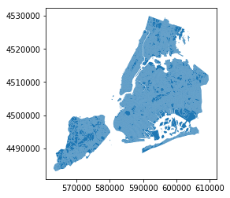

# GeoAlchemy 2

The purpose of these laboratory classes is to familiarize participants with [GeoAlchemy2](https://geoalchemy-2.readthedocs.io/en/latest/) .

GeoAlchemy 2 provides extensions to SQLAlchemy for working with spatial databases. This library focuses on PostGIS (1.5 and 2). 

SpatiaLite is also supported, but using GeoAlchemy 2 with SpatiaLite requires some specific configuration on the application side. GeoAlchemy 2 works with SpatiaLite 4.3.0 and higher.


## Introduction 
As in the previous instructions, the use of spatial databases is done through mapping:
- [mapper](https://docs.sqlalchemy.org/en/13/orm/mapping_api.html#sqlalchemy.orm.mapper)
-  [Class representation](https://docs.sqlalchemy.org/en/13/orm/tutorial.html)

For both, we must first connect to the database

```python

from sqlalchemy import create_engine
from geoalchemy2 import *

engine = create_engine(url_to_database)
```

We can use a script to initialize mapper operation:

```python
from sqlalchemy import create_engine, MetaData, Table

metadata = MetaData()

dic_table = {}
for table_name in engine.table_names():
    dic_table[table_name] = Table(table_name, metadata , autoload=True, autoload_with=engine)
	
print(repr(dic_table['nyc_neighborhoods']))
```

If we want youse Object representation we need run script:

```python
from sqlalchemy import create_engine, select, Column, Integer, String, Date, ForeignKey, PrimaryKeyConstraint, Float, SmallInteger
from sqlalchemy.orm import sessionmaker, relationship

session = (sessionmaker(bind=engine))()

Base = declarative_base()

class Geom_Example(Base):
     __tablename__ = 'geom_example'
     object_name = Column(String, primary_key=True)
     geom = Column(Geometry())


class NYC_Neighborhoods(Base):
    __tablename__ = 'nyc_neighborhoods'
    gid = Column(Integer, primary_key=True)
    boroname = Column(String)
    name = Column(String(64))
    geom = Column(Geometry('MultiPolygon'))
    def __str__(self):
        return """ gid: {}
boroname: {}
name: {}
geom: {}""".format(self.gid, self.boroname, self.name, self.geom)

```
The creation of tables in this type of database is similar to the basic version of the database engine.

## Insert spatial data

To insert data we can use one options:

- mapper:
```python

ins_ex1 = dic_table['geom_example'].insert().values(
object_name='example_1', 
geom='POLYGON((0 0,1 0,1 1,0 1,0 0))'
)

engine.execute(ins_ex1)
```

- class representation:
``` python
geom_ex1 = Geom_Example(object_name='example_1', 
geom='POLYGON((0 0,1 0,1 1,0 1,0 0))')
session.add(geom_ex1)
session.commit()

```
## Select data from spatial database

```python
from sqlalchemy import select

# select * from nyc_neighborhoods

mapper_stmt = select([dic_table['nyc_neighborhoods']])
mapper_results = engine.execute(mapper_stmt).fetchall()
print(result[0:3])

```
As a result of the script, we get a list of tuples representing the values of table rows. Examples:

```python
[(1, 'Brooklyn', 'Bensonhurst', <WKBElement at 0x20e482fa608; 0106000000010000000103000000010000001100000045f2f7d9e6c82141bff459dbcf25514181b1b59696d72141360d1f6921285141fa39bf8f9cdd ... (319 characters truncated) ... b2141dd94a694ae25514158f4672ce7ca2141f7bdc5a1ae2551418327df811cca2141727f0f25bc255141574bef70f1c921417731701cd125514145f2f7d9e6c82141bff459dbcf255141>),
 (2, 'Manhattan', 'East Village', <WKBElement at 0x20e482fa6c8; 01060000000100000001030000000100000008000000e94fc98149de214196ef19d1fe3351414271d0b694e821416a36040c4e33514144c142a7cde7 ... (31 characters truncated) ... 72141c6594a6e713251414da687822ae621415f9731007932514177db296de4da2141b7fdd828003351412db80bb38edb2141c844ce8054335141e94fc98149de214196ef19d1fe335141>),
 (3, 'Manhattan', 'West Village', <WKBElement at 0x20e482fa608; 010600000001000000010300000001000000340000009e65298ebecc2141eac610a88e33514118d5caa3d9cc2141591fd4b4b0335141b3c121f163ce ... (1439 characters truncated) ... 421410193e83a433451417213f557add421416b79fd152e345141cabb0527a2d22141b0b6b1b09433514101de574090d22141b958f7927a3351419e65298ebecc2141eac610a88e335141>)]
```
This form of results presentation is inconvenient if we use objectivity in all our software. To return results as a class, use the formula

```python
session_stmt = session.query(NYC_Neighborhoods)
session_results = session_stmt.all()
print(session_results[0:3])
# print information from first category in result list
print(\nFirst:)
print(session_results[0])
```
Results: 
```python
All results:
[<__main__.NYC_Neighborhoods object at 0x0000020E482FAD48>, <__main__.NYC_Neighborhoods object at 0x0000020E482FAA48>, <__main__.NYC_Neighborhoods object at 0x0000020E482FA2C8>]]

First:
gid: 1
boroname: Brooklyn
name: Bensonhurst
geom: 0106000000010000000103000000010000001100000045f2f7d9e6c82141bff459dbcf25514181b1b59696d72141360d1f6921285141fa39bf8f9cdd2141fa8e3eb88c27514176c9e5ef0de92141843fcc5c72265141eeabb14fe9de2141f2dee99443265141e1476c0622d62141203d83b8dd24514113ae95db18d52141879c50ced8245141805c69790fd42141f4fdb19009255141435db7e2c2d221416475af79352551412452ac852ad12141bd45c9646b255141af4370af2bcf2141099f789f8f25514136aca94906cd214157147b80ae255141dba4df01bccb2141dd94a694ae25514158f4672ce7ca2141f7bdc5a1ae2551418327df811cca2141727f0f25bc255141574bef70f1c921417731701cd125514145f2f7d9e6c82141bff459dbcf255141
```
As you can easily see in this case, the overloaded operator operator ** __ str __ **. 

If we want to create a complex query, we proceed in the same way as in the case of a normal database. Example:

```python
from sqlalchemy import func

mapper_stmt = select([dic_table['nyc_neighborhoods'].c.name, func.sum(func.ST_Area(dic_table['nyc_neighborhoods'].c.geom).label('area'))]).group_by(dic_table['nyc_neighborhoods'].c.name)

session_stmt = session.query(NYC_Neighborhoods.name, func.sum(func.ST_Area(
                    NYC_Neighborhoods.geom).label('area'))).group_by(NYC_Neighborhoods.name)
```
In this case, the query will return a list of results in both cases.

## geopandas

[GeoPandas](https://geopandas.org/index.html) is an open source library to working with geospatial data in python. GeoPandas extends the datatypes used by pandas to allow spatial operations on geometric types. It combines the capabilities of pandas and shapely, providing geospatial operations in pandas and a high-level interface to multiple geometries to shapely. GeoPandas enables you to easily do operations in python that would otherwise require a spatial database such as PostGIS.

### Using geopandas

```python 
import geopandas as gpd

query = select([dic_table['nyc_census_blocks']])
nyc_census_blocks_gpd = gpd.read_postgis(query, engine.connect())
nyc_census_blocks_gpd.plot()

```
Result:



## Exercise 
Use GeoAlchemy (and optional geopandas) to complete the tasks from the previous lab.


